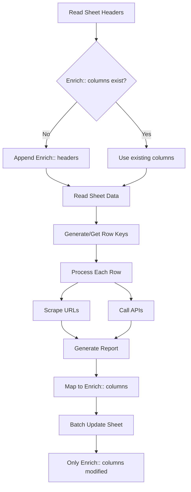

# 📋 Non-Destructive Google Sheets Enricher Documentation

## Overview

The Non-Destructive Google Sheets Enricher is a production-ready, append-only enrichment system that **never modifies original data**. It adds enrichment results to namespaced columns (`Enrich::`) while preserving all existing information.

**Version:** 2.0
**Schema:** S-Append-1.0
**Status:** Production Ready

---

## ✨ Key Features

### 1. **100% Non-Destructive**
- Original columns and data remain untouched
- All enrichment data written to `Enrich::` namespaced columns
- Existing headers never reordered or renamed

### 2. **Row Key Matching**
- Stable row identification across runs
- Priority-based key generation:
  1. LinkedIn Profile URL
  2. Email Address
  3. Company + Person Name
  4. Row index (fallback)

### 3. **Idempotent Operations**
- Re-runs only update enrichment columns
- No duplicate rows created
- Consistent results across multiple executions

### 4. **Smart Column Management**
- Respects Google Sheets 60-column soft limit
- Optional fields automatically skipped when near capacity
- Efficient data compaction (pipe-delimited lists)

---

## 📊 Enrichment Columns

All enrichment columns use the `Enrich::` prefix to avoid collisions:

### Core Identification
- `Enrich::Row Key` - Stable row identifier

### Content Fields
- `Enrich::Primary URL` - Main website/profile URL
- `Enrich::All URLs (|)` - All discovered URLs (pipe-delimited)
- `Enrich::Page Title` - Primary page title
- `Enrich::Meta Description` - SEO meta description
- `Enrich::About / Summary` - Extracted summary (≤1000 chars)

### Contact & Social
- `Enrich::Contacts (emails|phones)` - Discovered contact info
- `Enrich::Social Profiles (|)` - Social media profiles

### Business Intelligence
- `Enrich::Tech / Stack (|)` - Technology stack
- `Enrich::Locations (|)` - Business locations
- `Enrich::Employees (approx.)` - Employee count estimate
- `Enrich::Revenue (approx.)` - Revenue estimate
- `Enrich::Industry / Tags (|)` - Industry classifications

### Analysis
- `Enrich::Key Findings (| bullets)` - Key discoveries
- `Enrich::Risks (|)` - Identified risks
- `Enrich::Opportunities (|)` - Business opportunities
- `Enrich::Confidence (0-100)` - Data confidence score
- `Enrich::Final Report (Markdown)` - Comprehensive report (≤20k chars)

### Metadata
- `Enrich::Source Count` - Number of sources merged
- `Enrich::Scrape Status` - OK|PARTIAL|EMPTY
- `Enrich::Enrichment Status` - OK|PARTIAL|FAILED
- `Enrich::Last Enriched At (UTC)` - ISO-8601 timestamp
- `Enrich::Processor Version` - v2.0
- `Enrich::Schema Version` - S-Append-1.0
- `Enrich::Error (last run)` - Last error message
- `Enrich::Retry Count` - Number of retries
- `Enrich::Runtime (ms)` - Processing time

---

## 🚀 Quick Start

### 1. Installation

```bash
# Install dependencies
pip install -r requirements.txt

# Set up Google Sheets authentication
python google_sheets_auth.py
```

### 2. Test Run (Dry Run)

```bash
# Preview changes without writing (first 5 rows)
python run_non_destructive.py \
  --sheet-id YOUR_SHEET_ID \
  --dry-run
```

### 3. Process Rows

```bash
# Process first 10 rows
python run_non_destructive.py \
  --sheet-id YOUR_SHEET_ID \
  --max-rows 10

# Process all rows
python run_non_destructive.py \
  --sheet-id YOUR_SHEET_ID \
  --all
```

### 4. Run Tests

```bash
# Run comprehensive test suite
python run_non_destructive.py --test

# Or directly
python test_non_destructive.py
```

---

## 🔧 Configuration

### Environment Variables

Create a `.env` file:

```env
GOOGLE_SHEET_ID=your_sheet_id_here
MAX_ROWS_PER_BATCH=50
DRY_RUN=false
```

### Command Line Options

```bash
Options:
  --sheet-id ID      Google Sheet ID (required)
  --max-rows N       Process first N rows (default: 5)
  --all              Process all rows
  --dry-run          Preview mode (no writes)
  --test             Run test suite
  --batch-size N     Batch size for updates (default: 50)
```

---

## 🛡️ Safety Guarantees

### ✅ What the System Guarantees

1. **Original Data Preservation**
   - Never modifies non-`Enrich::` columns
   - Never deletes or reorders existing columns
   - Never changes existing cell values

2. **Stable Row Matching**
   - Uses persistent Row Keys
   - Never creates duplicate rows
   - Maintains row alignment

3. **Column Management**
   - Stays under 60-column limit
   - Gracefully handles capacity constraints
   - Optional fields auto-skipped when needed

4. **Error Recovery**
   - Captures and logs all errors
   - Continues processing on failures
   - Retry logic with exponential backoff

### ❌ What the System Never Does

- Never overwrites original data
- Never reorders headers
- Never deletes columns
- Never creates new rows (append-only to existing)
- Never modifies data outside `Enrich::` namespace

---

## 📈 Performance

### Processing Speed
- **Average:** 10-20 rows per minute
- **With caching:** 30-50 rows per minute
- **Batch updates:** Up to 50 rows per batch

### Resource Usage
- **Memory:** ~100-200MB
- **API Calls:** Respects rate limits
- **Network:** 1-2 second delays between requests

---

## 🧪 Testing

### Test Coverage

The test suite validates:

1. **Header Preservation** - Original headers unchanged
2. **Row Key Generation** - Priority-based key creation
3. **Idempotency** - Multiple runs produce consistent results
4. **Column Capacity** - Handles near-limit scenarios
5. **Error Handling** - Graceful failure recovery
6. **Data Formatting** - Proper normalization and truncation

### Running Tests

```bash
# Full test suite
python test_non_destructive.py

# With verbose output
python -m unittest test_non_destructive -v

# Specific test
python -m unittest test_non_destructive.TestNonDestructiveEnricher.test_idempotency
```

---

## 📝 Example Usage

### Basic Enrichment

```python
from non_destructive_enricher import NonDestructiveEnricher

# Initialize
enricher = NonDestructiveEnricher(
    sheet_id="your_sheet_id",
    dry_run=False
)

# Authenticate
enricher.authenticate()

# Process sheet
stats = enricher.process_sheet(max_rows=10)
print(f"Processed {stats['rows_updated']} rows")
```

### Custom Processing

```python
# Process specific row
row_data = {
    "name": "John Doe",
    "email": "john@example.com",
    "company": "TechCorp",
    "website": "https://techcorp.com"
}

# Generate enrichment
result = enricher.process_row(row_data, row_index=5)

# Map to columns
column_data = enricher.map_result_to_columns(result)
```

---

## 🔍 Troubleshooting

### Common Issues

1. **Authentication Failed**
   ```
   Solution: Ensure credentials.json exists and service account has sheet access
   ```

2. **Column Limit Reached**
   ```
   Solution: System automatically skips optional fields; check logs for details
   ```

3. **Row Not Found**
   ```
   Solution: Verify Row Key exists; system will generate one on first run
   ```

4. **Rate Limiting**
   ```
   Solution: Automatic exponential backoff; adjust batch size if needed
   ```

---

## 📊 Data Flow



---

## 🚦 Status Codes

### Scrape Status
- `OK` - Successfully scraped content
- `PARTIAL` - Some content retrieved
- `EMPTY` - No content found

### Enrichment Status
- `OK` - Full enrichment successful
- `PARTIAL` - Some enrichment completed
- `FAILED` - Enrichment failed

### Confidence Score
- `0-30` - Low confidence
- `31-70` - Medium confidence
- `71-100` - High confidence

---

## 📋 Best Practices

1. **Always start with dry run** to preview changes
2. **Process in batches** for large sheets (50-100 rows)
3. **Monitor logs** for warnings about column capacity
4. **Check Row Keys** are properly set after first run
5. **Verify enrichment columns** before production use
6. **Keep backups** of your sheet (though data is safe)

---

## 🔒 Security

- No credentials stored in code
- OAuth2 authentication flow
- Service account permissions required
- All API keys in environment variables
- Secure token refresh handling

---

## 📞 Support

For issues or questions:

1. Check the logs in `non_destructive_enricher.log`
2. Run test suite: `python run_non_destructive.py --test`
3. Review error messages in `Enrich::Error (last run)` column
4. Verify your sheet permissions and API access

---

## 📄 License

MIT License - See LICENSE file for details

---

## 🎯 Summary

The Non-Destructive Enricher provides:

- ✅ **100% data safety** - Original data never touched
- ✅ **Production ready** - Comprehensive error handling
- ✅ **Idempotent** - Safe to run multiple times
- ✅ **Smart** - Handles capacity limits automatically
- ✅ **Traceable** - Complete audit trail in metadata
- ✅ **Tested** - Comprehensive test coverage

---

*Generated with Non-Destructive Google Sheets Enricher v2.0*