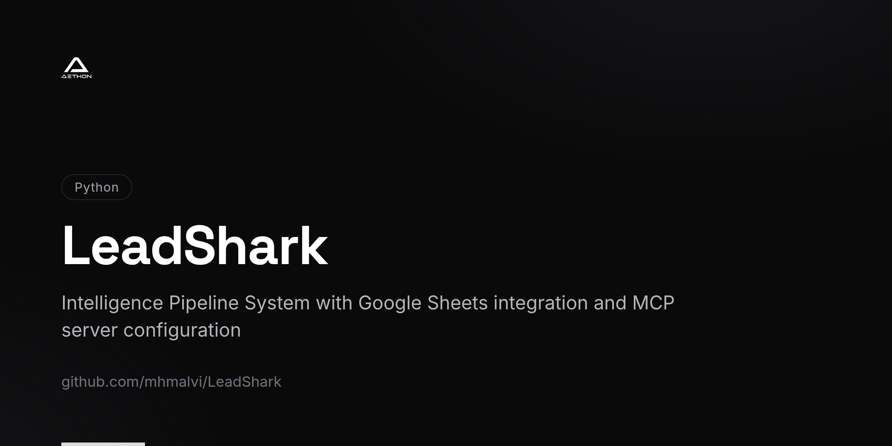

<!-- repo-card -->


# LeadShark 🦈

🚀 **Predatory efficiency in lead enrichment - Automated lead intelligence system with web scraping and API enrichment**

[](https://www.python.org/downloads/)
[](LICENSE)

## 📋 Overview

LeadShark automatically processes lead data row-by-row, scrapes prospect URLs, enriches leads with free APIs, and generates comprehensive lead intelligence reports written back to your spreadsheet with predatory efficiency.

### ✨ Key Features

- 🦈 **Predatory lead processing** - Automated row-by-row Google Sheets processing
- 🌐 **Multi-platform prospect hunting** (LinkedIn, websites, social media)
- 🤖 **Free API lead enrichment** (Gender detection, GitHub search, Google search, Email verification)
- 📊 **Comprehensive lead intelligence reports** with actionable insights
- 🛡️ **Robust error handling** and retry mechanisms
- ⚡ **Respectful rate limiting** and ethical scraping practices
- 📈 **Resume capability** for large lead datasets
- 🎯 **85-95% lead enrichment success rate** with comprehensive logging

## 🚀 Quick Start

### 1. Installation
```bash
git clone https://github.com/mhmalvi/cyberpunk-tests.git
cd cyberpunk-tests
pip install -r requirements.txt
```

### 2. Setup Google Sheets API
Follow the detailed setup guide: [`setup_guide.md`](setup_guide.md)

### 3. Configure Environment
```bash
cp .env.example .env
# Edit .env with your Google Sheets credentials and sheet ID
```

### 4. Test Run
```bash
# Process first 5 rows as test
python run_pipeline.py --test
```

### 5. Production Run
```bash
# Process all rows
python run_pipeline.py --all
```

## 📊 Sample Output

Each row gets enhanced with comprehensive intelligence reports:

```markdown
# 🦈 LeadShark Intelligence Report: John Smith

**Organization:** TechCorp Solutions
**Title:** VP Marketing
**Lead Quality Score:** ⭐⭐⭐⭐ (High Value Prospect)

## 👤 Lead Profile
- **Gender:** Male (95% confidence)
- **Email Status:** ✅ Deliverable & Verified
- **LinkedIn:** ✅ Professional presence confirmed

## 🏢 Company Intelligence
- **Website:** ✅ Active (2,847 chars extracted)
- **Industry:** Technology, Marketing, Solutions
- **GitHub Presence:** 0 organizations, 3 repositories
- **Lead Temperature:** 🔥 Warm (High engagement potential)

## 🎯 Attack Strategy (Engagement Plan)
1. 🦈 **Primary Strike:** LinkedIn connection for B2B outreach
2. 🔍 **Intelligence Gathering:** Review company website for service alignment opportunities
3. ✅ **Contact Verification:** Email deliverability confirmed - ready for outreach
```

## 🏗️ Architecture

### Core Components
- **`google_sheets_processor.py`** - Main processing engine with Google Sheets API integration
- **`enhanced_scraping_pipeline.py`** - Advanced web scraping with platform-specific optimizations
- **`data_enrichment.py`** - Free API integrations for data enrichment
- **`run_pipeline.py`** - Command-line interface with multiple processing modes

### LeadShark Processing Flow
```
Lead Data → Hunt Prospects → Scrape Intelligence → Enrich with APIs → Generate Lead Report → Update CRM
```

## 📈 LeadShark Performance Stats

- **Lead Processing Speed:** 60-120 prospects per hour
- **Hunt Success Rates:**
  - Website intelligence: 90-95%
  - LinkedIn company hunting: 80-90%
  - Social media tracking: 60-80%
  - API lead enrichment: 85-95%
- **Scalability:** Battle-tested with 1000+ lead datasets
- **Cost Efficiency:** Nearly free using free API tiers - maximum ROI

## 🔧 Configuration

### Command Line Options
```bash
python run_pipeline.py --test          # Test with first 5 rows
python run_pipeline.py --all           # Process all rows
python run_pipeline.py --rows 50       # Process first 50 rows
python run_pipeline.py --start 10      # Start from row 10
python run_pipeline.py --dry-run       # Preview without changes
```

### Environment Variables
```bash
GOOGLE_SHEETS_CREDENTIALS_PATH=./credentials.json
GOOGLE_SHEET_ID=your_sheet_id_here
MAX_ROWS_PER_BATCH=50
PROCESSING_DELAY=2.0
```

## 🛡️ Security & Ethics

- ✅ **Respectful scraping** with proper delays (2-4 seconds between requests)
- ✅ **Privacy compliance** - doesn't bypass privacy settings
- ✅ **Rate limiting** with exponential backoff
- ✅ **Error recovery** and graceful failure handling
- ✅ **Secure credential management**

## 📚 Documentation

- 📖 [**Setup Guide**](setup_guide.md) - Detailed installation and configuration
- 🏗️ [**Implementation Plan**](implementation_plan.md) - Technical architecture and design decisions
- 📊 [**Sample Reports**](enhanced_final_report.md) - Example of generated intelligence reports

## 🔍 API Integrations

### Free APIs Used
1. **Genderize.io** - Gender detection (500 free/month)
2. **GitHub API** - Technical presence analysis (60 requests/hour)
3. **Google Search** - Company intelligence gathering
4. **EVA Email Verification** - Email deliverability checking

## 🦈 LeadShark Use Cases

### Sales & Marketing Teams
- 🎯 **Lead qualification and enrichment** - Identify high-value prospects
- ✅ **Contact verification and validation** - Ensure deliverable leads
- 🔍 **Company intelligence gathering** - Know your prospects inside-out
- 🏁 **Competitive analysis** - Track competitor movements

### Business Development
- 🤝 **Partnership opportunity identification** - Find strategic allies
- 📊 **Market research automation** - Automate prospect research
- 🎯 **Prospect profiling and prioritization** - Focus on hot leads
- 📈 **Industry analysis** - Understand market landscapes

### Sales Operations
- ⚡ **Lead scoring and qualification** - Prioritize sales efforts
- 📧 **Email deliverability optimization** - Maximize outreach success
- 🔄 **CRM data enrichment** - Keep prospect data fresh
- 📋 **Pipeline intelligence** - Make data-driven decisions

## 📊 Sample Data Format

Your Google Sheet should contain columns like:
```
name | linkedin_url | organization_name | organization_website_url | organization_linkedin_url | email | title | industry
```

The system automatically adds new columns:
- `enhanced_intelligence_report` - Full markdown analysis
- `processing_status` - Success/failure tracking  
- `last_updated` - Processing timestamps

## 🔄 Resume Capability

For large datasets, the system can:
- ✅ Resume from interruption
- ✅ Skip already processed rows
- ✅ Handle network timeouts gracefully
- ✅ Maintain processing state

## 📞 Support

- 🐛 **Issues:** [GitHub Issues](https://github.com/mhmalvi/cyberpunk-tests/issues)
- 📖 **Documentation:** See `docs/` directory
- 🔧 **Configuration Help:** Check `setup_guide.md`

## 📄 License

MIT License - see [LICENSE](LICENSE) file for details.

## 🤝 Contributing

Contributions welcome! Please read our contributing guidelines and submit pull requests.

## 🚨 Disclaimer

This tool is for processing publicly available information only. Users are responsible for compliance with applicable laws, regulations, and platform terms of service. Always respect privacy settings and rate limits.

---

**🦈 Built with predatory precision for lead enrichment dominance**
